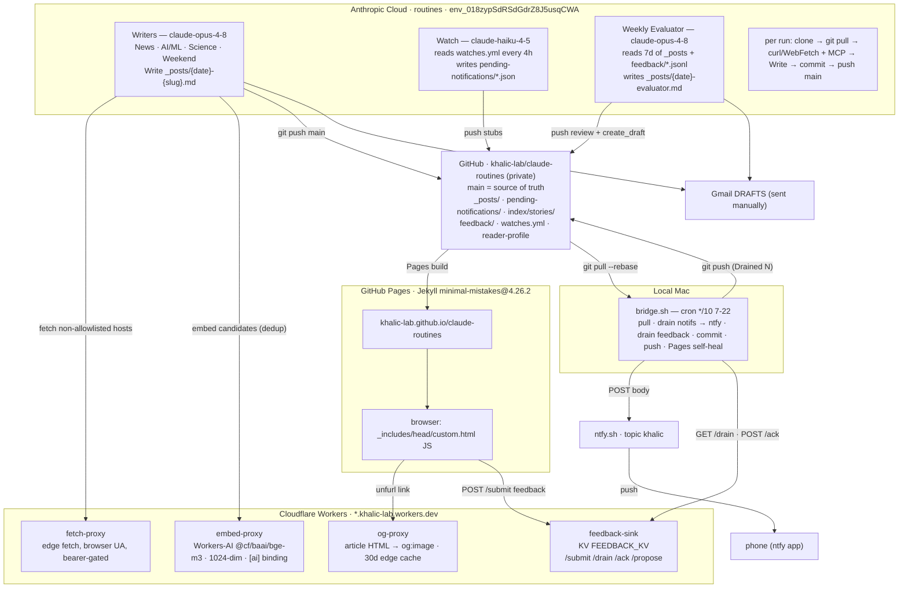

# 01 · System overview — components & data flow

End-to-end: cloud routines research and write briefs into the git repo; GitHub Pages publishes
them; a local Mac bridge fans notifications out to the phone; Cloudflare Workers serve the
client-side enrichments and the feedback sink. `main` is the single source of truth.

**Grounded in:** `ARCHITECTURE.md` §1.1, `_config.yml` (remote_theme, baseurl), `CLAUDE.md`
(env + trigger IDs), `tools/{og-proxy,embed-proxy,fetch-proxy,feedback-sink}/wrangler.toml`,
`_includes/head/custom.html`. The Mac bridge `bridge.sh` + `.env`
(`/usr/local/src/news-brief-ntfy-bridge/`) are excluded from the repo by `_config.yml`.
