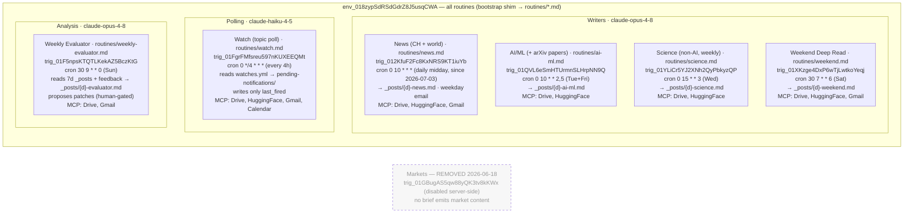

# 02 · Routines — triggers, models, schedules, outputs

Every routine runs in the same environment (`env_018zypSdRSdGdrZ8J5usqCWA`). Since 2026-06-29 each
trigger (except Watch) holds a small bootstrap shim that reads its real prompt from `routines/*.md`
at fire time — the repo files ARE the live prompts. Model tiers are split by job (see `docs/SPIKE-model-tiering.md`): writers
and analysis on Opus, high-frequency polling on Haiku. Cron is UTC.

**Grounded in:** `CLAUDE.md` (stable identifiers — env + all trigger IDs), `ARCHITECTURE.md` §1.1
(crons, models), `routines/MANIFEST.md`, `routines/*.md` (the live prompts, read via the bootstrap shim).
The RemoteTrigger API exposes no delete, so the Markets trigger config is retained but disabled.
