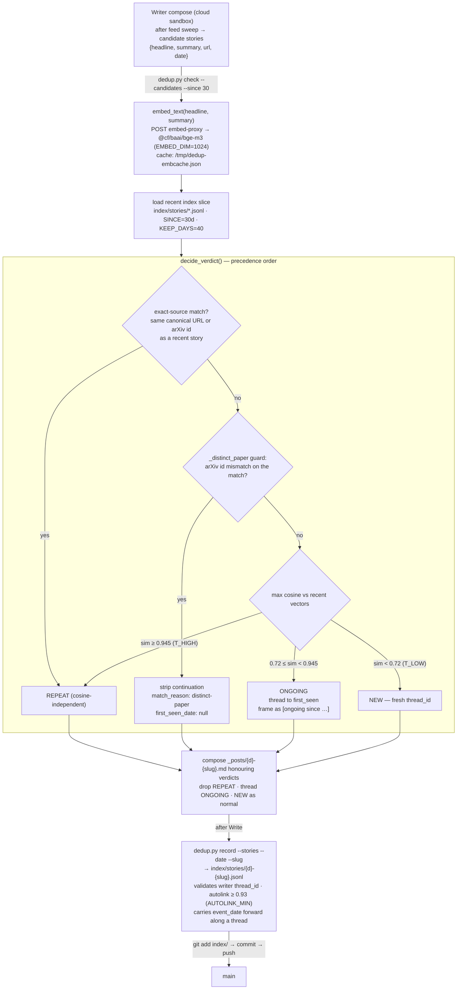

# 03 · Compose-time dedup — `tools/dedup/dedup.py`

Dedup runs **inside the ephemeral cloud sandbox at compose time** — the only moment a writer can
decide "skip / thread / keep". The sandbox has HTTPS-allowlist egress only, so the index lives in
the git repo (`index/stories/*.jsonl`) and embeddings come from the allowlisted `embed-proxy`
Worker. Verdict precedence and thresholds are from `decide_verdict()`.

**Calibration caveat (from `docs/archive/DEDUP-DIAGNOSIS-2026-05-31.md`):** cosine alone does *not* separate
"same story restated" from "same story with a real update" (they overlap ~0.6–0.95), so the
similarity threshold catches almost no reruns. Repeat-suppression rests on the **deterministic
exact-source layer** plus the `DEDUP.md` Step-B "ONGOING-defaults-to-drop" writer policy.
Auto-threading in `record` is gated separately at `AUTOLINK_MIN=0.93`, above the observed 0.914
DISTINCT ceiling, to avoid false merges.

**Subcommands** (`dedup.py`, stdlib-only so it runs without pip in the sandbox):
`check` · `record` · `backfill` (seed from `_posts/*.md`) · `lint` (post-compose date checks) ·
`selftest` (offline logic checks).

**Grounded in:** `tools/dedup/dedup.py` (`decide_verdict`, `cmd_check/record/backfill/lint`,
`embed_text`, `_distinct_paper`, `T_HIGH_DEFAULT=0.945`, `T_LOW_DEFAULT=0.72`,
`AUTOLINK_MIN_DEFAULT=0.93`, `EMBED_MODEL=bge-m3`, `EMBED_DIM=1024`), `tools/dedup/DEDUP.md`,
`tools/embed-proxy/wrangler.toml`, `ARCHITECTURE.md` §6, `index/stories/`.
