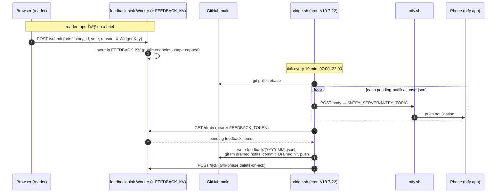

# 04 · Local bridge — notification delivery + feedback drain

One cron-driven `bridge.sh` tick (every 10 min, 07:00–22:00 local) reconciles `main`: it pushes
queued notifications to the phone via ntfy and drains reader feedback from the `feedback-sink`
Worker into the repo. Feedback uses a **two-phase delete-on-ack** so a missed tick neither loses
nor double-commits items.

Notes:
- `/submit` is **public** (a browser cannot hold a bearer); `/drain` + `/ack` are bearer-gated with
  `FEEDBACK_TOKEN`. `feedback.py` sends an identifiable User-Agent because Cloudflare 403s the
  default `Python-urllib`.
- The notification stub shape is `{title, click, body, tags}`; writers and the Watch routine queue
  them, the bridge deletes each after a successful push.
- Privacy: reason text routes through the private Worker + private repo, never an ntfy topic.

**Grounded in:** `ARCHITECTURE.md` §1.4 + §1.1 (bridge steps), `tools/feedback-sink/`
(`wrangler.toml` → `FEEDBACK_KV`; README → endpoints), `tools/feedback/feedback.py`, the bridge
config keys (`NTFY_TOPIC`, `NTFY_SERVER`, `REPO`, `FEEDBACK_WORKER_URL`, `FEEDBACK_TOKEN`).
