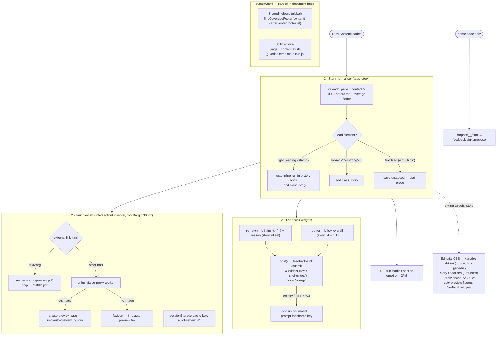

# 05 · Frontend rendering pipeline — `_includes/head/custom.html`

All custom CSS + JS is layered over the minimal-mistakes "default" skin and loads last in the
document head. On `DOMContentLoaded` a sequence of passes transforms the kramdown-rendered brief
into the editorial layout, then enriches it with link previews, feedback widgets and the unlock
modal. The editorial CSS targets only `.story` — the class the normaliser tags — so the
Coverage-footer / "Gaps:" list stays plain prose.

Notes:
- Per-story `story_id` is `{date}-{slug}-{slugify(bold lead)}`, mirroring `dedup.py slugify()` so
  the Evaluator can join feedback back to stories by re-slugifying the same bold leads.
- The story id slug prefix comes from `window.__BRIEF` (injected by Jekyll on post pages only).
- Both the normaliser and the feedback pass stop at the Coverage footer via the shared
  `findCoverageFooter()` / `afterFooter()` helpers.

**Grounded in:** `_includes/head/custom.html` (every class/function named here is literal), the
arXiv markup shapes in `_posts/*.md`, `tools/og-proxy/` + `tools/feedback-sink/`, and
`_layouts/home.html` (`.home-hero`, `.home-tagline`, `.entries-list`, `.propose__form`).
