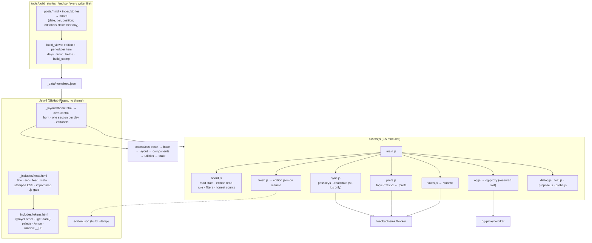

# 05 · Frontend rendering: the day-edition homepage (2026-09-24)

The site owns its layouts; there is no theme. The builder decides, Liquid prints, CSS lays out in
cascade layers, and a handful of ES modules add the interactive state. No script measures or
places anything: filtering only toggles `hidden`, and DOM order is visual order.

```mermaid
flowchart TD
  subgraph build["tools/build_stories_feed.py (every writer fire)"]
    B1["_posts/*.md + index/stories → board<br/>(date, tier, position; editorials close their day)"]
    B2["build_views: edition + period per item<br/>days · front · beats · build_stamp"]
    B1 --> B2
  end
  B2 --> HF["_data/homefeed.json"]
  HF --> L

  subgraph jekyll["Jekyll (GitHub Pages, no theme)"]
    L["_layouts/home.html → default.html<br/>front · one section per day · editorials"]
    H["_includes/head.html<br/>title · seo · feed_meta · stamped CSS · import map · .js gate"]
    T["_includes/tokens.html<br/>@layer order · light-dark() palette · Anton · window.__FB"]
    E["edition.json (build_stamp)"]
    H --> T
  end

  L --> CSS["assets/css: reset → base → layout → components → utilities → state"]
  L --> JS

  subgraph JS["assets/js (ES modules)"]
    M["main.js"] --> BO["board.js<br/>read state · edition read rule · filters · honest counts"]
    M --> SY["sync.js<br/>passkeys · /readstate (st- ids only)"]
    M --> PR["prefs.js<br/>topicPrefs:v1 ↔ /prefs"]
    M --> VO["votes.js → /submit"]
    M --> OG["og.js → og-proxy (reserved slot)"]
    M --> FR["fresh.js → edition.json on resume"]
    M --> DI["dialog.js · fold.js · propose.js · probe.js"]
  end
  FR -.-> E
  SY --> FS["feedback-sink Worker"]
  PR --> FS
  VO --> FS
  OG --> OGW["og-proxy Worker"]
```

Notes:
- Read ids ride on the item element (`data-story`: `sid | default: id`, or `ed-<stream>-<date>`);
  `data-edition` (`<date>-<stream>`) is the `/submit` `brief` and the key of the editorial read rule.
- Storage keys: `homeRead:v1`, `syncState:v1`, `topicPrefs:v1`, `syncSession:v1`, `homeUnread:v1`
  (local only), sessionStorage `homeOg:v2:`.
- Evaluator reviews, `/prompts/` and the 404 use `_layouts/single.html` + `assets/css/prose.css`;
  `/admin/` is self-owned and shares only `tokens.html`.

**Grounded in:** `_layouts/home.html`, `_includes/{head,tokens}.html`, `_includes/home/*.html`,
`assets/css/*.css`, `assets/js/*.js`, `tools/build_stories_feed.py` (`build_views`), and
`docs/PLAN-2026-09-24-front-page-rewrite.md`.
